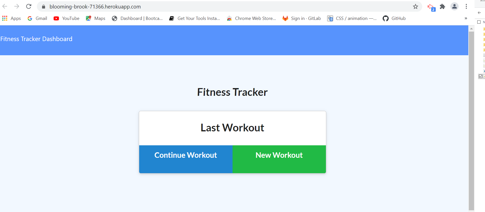

## Project Title
# Workout_Tracker  

## Description
AS A small business owner I WANT to be able to write and save notes SO THAT I can organize my thoughts and keep track of tasks I need to complete


## Installation Instructions
You will need following  :

* Node.js

* Express.js

* MongoDB

* Mongoose


```
## Web Url :

Navigate to : https://blooming-brook-71366.herokuapp.com/

## Usage

## Mock-up 



## Contribution Guidelines
Link to Contributor's Covenant: https://www.contributor-covenant.org/version/2/0/code_of_conduct/

## License


*This project uses the [MIT](https://spdx.org/licenses/MIT.html) license.*


## Questions
Github Profile : [Creator]:(https://github.com/bhavipatel21)

If you have any questions please email me at bhavij0511@gmail.com
